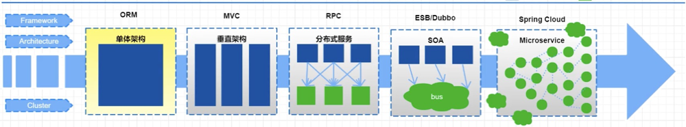

[toc]

# 1、什么是微服务

2014年，`Martin Fowler`（**马丁·福勒** ）
提出了微服务的概念，定义了微服务是由以单一应用程序构成的小服务，自己拥有自己的进程与轻量化处理，服务依业务功能设计，以全自动的方式部署，与其他服务使用 `HTTP API`
通信。
同时服务会使用最小的规模的集中管理能力，服务可以用不同的编程语言与数据库等组件实现。

随着互联网的发展，网站应用的规模也不断的扩大，进而导致系统架构也在不断的进行变化，从互联网早起到现在，系统架构大体经历了下面几个过程

## 1.1、单体应用架构

把所有功能都集中在一个应用中，统一部署，开发成本、部署成本和维护成本低

- 优点: 目架构简单，适合用户量少的项目，开发成本低，项目部署在一个节点上，维护方便。
- 缺点: 功能集中在一个工程中，对于大型项目比一开发和维护，项目模块紧耦合，单点容错率低，无法对不同的模块功能进行针对性的优化和水平拓展。

## 1.2、垂直应用架构

所谓垂直应用架构，其实就是把之前的单体应用拆分成多个应用，以提升效率，比如电商系统可以拆分成：电商系统、后台系统、CMS系统。

- 优点: 项目拆分实现了流量分担，解决了并发问题，而且可以针对不同模块进行优化和水平拓展，同时不同的系统之间不会互相影响，提高容错率。
- 缺点: 系统之间互相存在，无法进行相互调用，系统之间互相独立，会造成一部分功能的冗余。

## 1.3、分布式架构

随着业务的增加，在垂直应用架构中冗余的业务代码越来越多，就需要将冗余的部分抽取出来，统一做成业务层单独处理，变成一个单独的服务，控制层调用不同的业务层服务就能完成不同的业务功能，
具体表现就是一个项目拆分成表现层和服务层两个部分，服务层中包含业务逻辑，表现层只需要处理和页面的交互，业务逻辑都是调用服务层的服务来实现，这就是分布式架构。

- 优点: 抽取公共的功能作为服务层，提高代码复用行。
- 缺点: 系统间耦合度变高，调用关系错综复杂，难以维护。

## 1.4、SOA架构

分布式架构中的缺点就是调用复杂，而且当服务越来越多，或者当某一个服务压力过大需要水平拓展和负载均衡，对于资源调度和治理就需要用到治理中心 `SOA`（`Service Oriented Architecture`
）为核心来解决，同时治理中心还可以帮助我们解决服务之间协议不同的问题。

- 优点: 使用治理中心（`ESB\dubbo`）解决了服务见调用关系的自动调节
- 缺点: 服务间会有依赖关系，一旦某个环节出错会影响较大（服务雪崩），服务关系复杂，运维、测试部署困难。

## 1.5、微服务架构

微服务架构在某种程度上面架构`SOA`继续发展的下一步，它更加强调服务的“彻底拆分”，目的就是提高效率，微服务架构中，每个服务必须独立部署同时互不影响，微服务架构更加轻巧，轻量级。

微服务架构与SOA架构的不同

1. 微服务架构比SOA架构会更加的精细，让专业的人去做专业的。
2. 目的是提高效率每个服务之间互不影响，微服务架构中，每个服务需要独立部署
3. SOA架构中可能数据库存储会发生共享，微服务强调每个服务都是单独数据库，保证每个服务之间互不影响。
4. 微服务项目架构比SOA架构更加适合与互联网公司迅捷开发、快速迭代版本，因为粒度非常精细。

## 2、`Spring Cloud Alibaba`

中文文档地址: https://github.com/alibaba/spring-cloud-alibaba/blob/2.2.x/README-zh.md

`Spring Cloud Alibaba`
致力于提供微服务开发的一站式解决方案。此项目包含开发分布式应用微服务的必需组件，方便开发者通过 `Spring Cloud`
编程模型轻松使用这些组件来开发分布式应用服务。

依托 `Spring Cloud Alibaba`，只需要添加一些注解和少量配置，就可以将 `Spring Cloud` 应用接入阿里微服务解决方案，通过阿里中间件来迅速搭建分布式应用系统。

## 2.1、主要功能

- **服务限流降级** ：默认支持 `WebServlet`、`WebFlux`, `OpenFeign`、`RestTemplate`、`Spring Cloud Gateway`, `Zuul`, `Dubbo`
  和 `RocketMQ` 限流降级功能的接入，可以在运行时通过控制台实时修改限流降级规则，还支持查看限流降级 Metrics 监控。
- **服务注册与发现** ：适配 `Spring Cloud` 服务注册与发现标准，默认集成了 `Ribbon` 的支持。
- **分布式配置管理** ：支持分布式系统中的外部化配置，配置更改时自动刷新。
- **消息驱动能力** ：基于` Spring Cloud Stream` 为微服务应用构建消息驱动能力。
- **分布式事务** ：使用 `@GlobalTransactional` 注解， 高效并且对业务零侵入地解决分布式事务问题。
- **阿里云对象存储** ：阿里云提供的海量、安全、低成本、高可靠的云存储服务。支持在任何应用、任何时间、任何地点存储和访问任意类型的数据。
- **分布式任务调度** ：提供秒级、精准、高可靠、高可用的定时（基于 `Cron`
  表达式）任务调度服务。同时提供分布式的任务执行模型，如网格任务。网格任务支持海量子任务均匀分配到所有 `Worker`（`schedulerx-client`
  ）上执行。
- **阿里云短信服务** ：覆盖全球的短信服务，友好、高效、智能的互联化通讯能力，帮助企业迅速搭建客户触达通道。

## 2.2、组件介绍

- **[Sentinel]** ：阿里巴巴源产品，把流量作为切入点，从流量控制、熔断降级、系统负载保护等多个维度保护服务的稳定性。
- **[Nacos]** ：一个更易于构建云原生应用的动态服务发现、配置管理和服务管理平台。
- **[RocketMQ]** ：一款开源的分布式消息系统，基于高可用分布式集群技术，提供低延时的、高可靠的消息发布与订阅服务。
- **[Dubbo]** ：`Apache Dubbo™` 是一款高性能 `Java RPC` 框架。
- **[Seata]** ：阿里巴巴开源产品，一个易于使用的高性能微服务分布式事务解决方案。
- **[Alibaba Cloud OSS]** : 阿里云对象存储服务（`Object Storage Service`，简称 `OSS`
  ），是阿里云提供的海量、安全、低成本、高可靠的云存储服务。您可以在任何应用、任何时间、任何地点存储和访问任意类型的数据。
- **[Alibaba Cloud SchedulerX]**:
  阿里中间件团队开发的一款分布式任务调度产品，提供秒级、精准、高可靠、高可用的定时（基于 `Cron` 表达式）任务调度服务。
- **[Alibaba Cloud SMS]** : 覆盖全球的短信服务，友好、高效、智能的互联化通讯能力，帮助企业迅速搭建客户触达通道。

## 2.3、版本说明

版本文档: https://github.com/alibaba/spring-cloud-alibaba/wiki/%E7%89%88%E6%9C%AC%E8%AF%B4%E6%98%8E