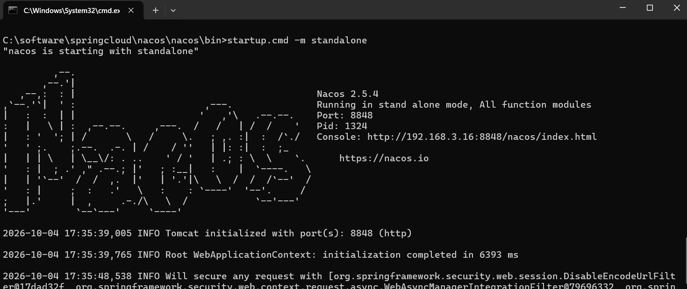
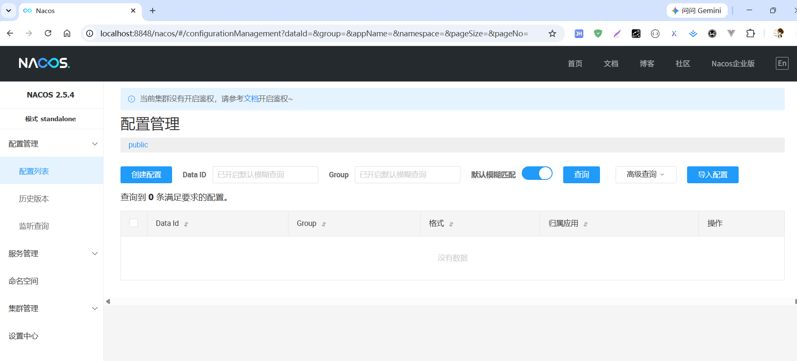
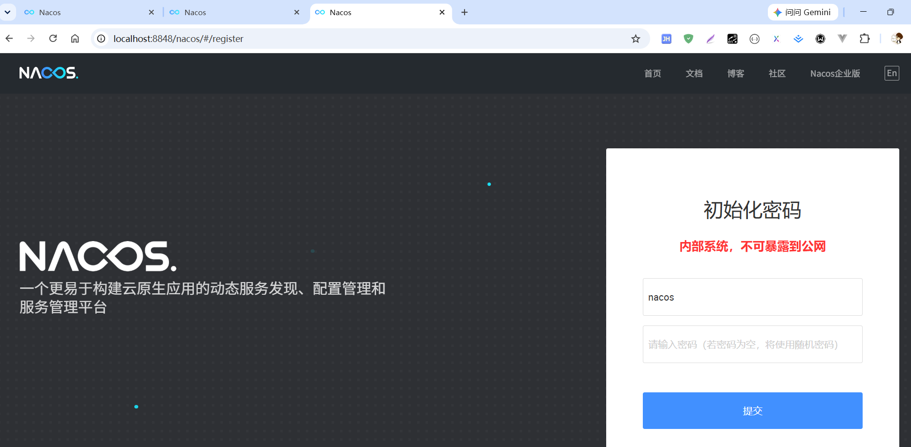
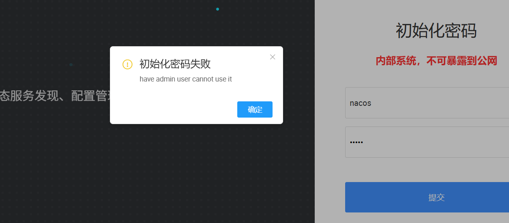

[toc]

## 1、`Nacos` 简介

`Nacos`（`Naming Configuration Service`）是一个易于使用的动态服务发现、配置和服务管理平台，用于构建云原生应用程序。

**服务发现是微服务架构中的关键组件之一**。`Nacos` 致力于帮助发现、配置和管理微服务。`Nacos` 提供了一组简单易用的特性集，帮助您快速实现动态服务发现、服务配置、服务元数据及流量管理。

`Nacos` 帮助您更敏捷和容易地构建、交付和管理微服务平台。 `Nacos` 是构建以“服务”为中心的现代应用架构 (例如微服务范式、云原生范式) 的服务基础设施。

> `Nacos` = **注册中心+配置中心组合**

`Nacos` 支持几乎所有主流类型的 **服务** 的发现、配置和管理，常见的服务如下：

- `Kubernetes Service`
- `gRPC & Dubbo RPC Service`
- `Spring Cloud RESTful Service`

# 2、`Nacos` 下载和安装

## 2.1、`Nacos` 下载

`Nacos` 官网地址: https://nacos.io/zh-cn/index.html
`Nacos` 官网文档地址: https://nacos.io/docs/next/quickstart/quick-start/

> 系统环境 & 下载地址

- 当前系统 `win11`，使用的是 `nacos 2.5.4` 版本
- 下载地址: https://download.nacos.io/nacos-server/nacos-server-2.5.4.zip?spm=5238cd80.6a33be36.0.0.70ad1e5dw5ELnL&file=nacos-server-2.5.4.zip

下载到本地解压后的 `nacos` 目录结构如下:

```txt
C:\software\springcloud\nacos\nacos>tree /F
C:.
│  LICENSE
│  NOTICE
│
├─bin
│      shutdown.cmd
│      shutdown.sh
│      startup.cmd
│      startup.sh
│
├─conf
│      1.4.0-ipv6_support-update.sql
│      announcement_en-US.conf
│      announcement_zh-CN.conf
│      application.properties
│      application.properties.example
│      cluster.conf.example
│      console-guide.conf
│      derby-schema.sql
│      derby-upgrade-visibility-permission-resource.sql
│      mysql-schema.sql
│      mysql-upgrade-visibility-permission-resource.sql
│      nacos-logback.xml
│      oracle-schema.sql
│      oracle-upgrade-visibility-permission-resource.sql
│      pg-ai-vector-schema.sql
│      pg-grant-nacos-readwrite.sql
│      pg-schema.sql
│      pg-upgrade-null-tenant-id.sql
│      pg-upgrade-visibility-permission-resource.sql
│
└─target
        nacos-server.jar
```

## 2.2、`Nacos` 启动

- `Linux` 下执行: `sh startup.sh -m standalone`
- `Windows` 下执行: `startup.cmd -m standalone`

备注: `standalone` 代表着单机模式运行，非集群模式;



验证 `nacos` 服务是否启动成功，访问如下地址: `http://localhost:8848/nacos`



注意: `Nacos 2.5.4` 默认是不需要登录的 (`nacos.core.auth.enabled=false`)，通过修改如下配置服务端开启鉴权

```properties
# conf/application.properties

# 1. 打开nacos鉴权总开关，默认false
nacos.core.auth.system.type=nacos
nacos.core.auth.enabled=true

# 2. 自定义 JWT 签名密钥（Base64，原始密钥长度 ≥ 32 字符）
nacos.core.auth.plugin.nacos.token.secret.key=RgufCCgIc/VsfszJuDHHi3xh/2rLg/8otezCzEGx3kI=

# 3. 服务端之间通信的身份识别（集群环境必配，单机也建议配）
nacos.core.auth.server.identity.key=myClusterSecretKey
nacos.core.auth.server.identity.value=myClusterSecretValue
```

修改完上述配置后，理论上再次刷新页面会进入到登录页面



默认的账号密码都是 `nacos/nacos`，但是从 `2.4.0` 起 `Nacos` 不再内置 `nacos/nacos` 默认密码。首次开鉴权后，必须初始化管理员账号，否则控制台进不去，报如下错误



首次调用命令可能会报错，原因是因为账号已经存在了，但是密码不知道，可以按照如下步骤处理:

1. 关闭 `nacos` 服务;
2. 删除 `data/derby-data` 目录 (会丢失所有配置和服务数据，仅限自己学习);
3. 重启 `nacos` 服务，再次执行 `curl` 命令；

```shell
# ======================= linux =======================
# 指定密码
curl -X POST 'http://你的IP:8848/nacos/v1/auth/users/admin' -d 'password=你的强密码'

# 或者不传 password，让服务端生成随机密码（记得保存返回值）
curl -X POST 'http://你的IP:8848/nacos/v1/auth/users/admin'

curl -X POST 'http://localhost:8848/nacos/v1/auth/users/admin' -d 'password=nacos'


# ======================== windows ======================
# windows power shell 执行如下命令
Invoke-WebRequest -Uri "http://localhost:8848/nacos/v1/auth/users/admin" -Method POST -Body "password=nacos"


PS C:\Users\he875> Invoke-WebRequest -Uri "http://localhost:8848/nacos/v1/auth/users/admin" -Method POST -Body "password=nacos"

安全警告: 脚本执行风险
Invoke-WebRequest 可解析网页内容。解析网页时，可能会运行网页中的脚本代码。
      建议的操作:
      使用 -UseBasicParsing 开关来避免执行脚本代码。

      是否要继续?

[Y] 是(Y)  [A] 全是(A)  [N] 否(N)  [L] 全否(L)  [S] 暂停(S)  [?] 帮助 (默认值为“N”): y

# 请求调用成功
StatusCode        : 200
StatusDescription :
# 账号密码初始化成功，返回的账号密码
Content           : {"username":"nacos","password":"nacos"}
RawContent        : HTTP/1.1 200
                    Vary: Origin,Access-Control-Request-Method,Access-Control-Request-Headers
                    Content-Security-Policy: script-src 'self'
                    Transfer-Encoding: chunked
                    Content-Type: application/json
                    Date: ...
Forms             : {}
Headers           : {[Vary, Origin,Access-Control-Request-Method,Access-Control-Request-Headers], [Content-Security-Pol
                    icy, script-src 'self'], [Transfer-Encoding, chunked], [Content-Type, application/json]...}
Images            : {}
InputFields       : {}
Links             : {}
ParsedHtml        : mshtml.HTMLDocumentClass
RawContentLength  : 39
```

### 2.2.1 `nacos.core.auth.plugin.nacos.token.secret.key` 是什么

`Nacos` 服务端用来签发和验证 `JWT Token` 的签名密钥，作用如下：

1. `Token` 签发：当客户端（`SDK`、控制台）通过用户名密码登录成功时，`Nacos` 服务端会用这个密钥生成一个 `JWT token` 返回给客户端。
2. `Token` 校验：后续客户端每次请求（注册服务、拉取配置等）都携带这个 `token`，服务端用同样的密钥验证 `token` 是否有效、是否过期、是否被伪造。

> 为什么需要配置

- `2.2.0.1` 之前：`Nacos` 有一个内置的默认密钥（公开在源码和文档中），任何人都可以用它伪造合法 `token`，等于鉴权形同虚设。
- `2.2.0.1` 之后：官方移除了默认密钥，必须手动配置，否则节点启动时会直接报错退出，强制你设置一个安全的密钥。

> 配置要求

- `Base64` 编码：值必须是 `Base64` 编码后的字符串。
- 原始密钥长度 `≥ 32` 字节：即解码前的原始字符串至少 `32` 个字符（建议用 `256` 位随机密钥）。
- 集群内所有节点必须一致：否则一个节点签发的 `token` 会被另一个节点拒绝，导致 `403` 错误。

> 如何生成一个合规的密钥

```shell
# linux
openssl rand -base64 32

# windows
[Convert]::ToBase64String((1..32 | ForEach { Get-Random -Maximum 256 }))

# 在线生成
可以使用任何 Base64 编码工具，但确保原始字符串 ≥ 32 字符。


# 在 windows 下生成
PS C:\Users\he875> [Convert]::ToBase64String((1..32 | ForEach { Get-Random -Maximum 256 }))
RgufCCgIc/VsfszJuDHHi3xh/2rLg/8otezCzEGx3kI=
PS C:\Users\he875>
```

### 2.2.2 `nacos.core.auth.server.identity.key`

当 `Nacos` 开启鉴权（`nacos.core.auth.enabled=true`）后，节点之间的交互（如心跳、数据同步、`Leader` 选举等）也需要进行身份验证。这个配置就是为节点间通信提供一套独立的身份标识，不依赖客户端的 `JWT token`。

- 验证节点身份：当一个节点向另一个节点发送内部请求时，会在请求头中带上 `{key}: {value}`，接收方校验该头是否存在且值与本地配置一致，一致才放行。
- 防止外部伪装：如果没有这个校验，攻击者可以直接向 `Nacos` 节点发送内部 `API` 请求（如配置变更、服务数据操作），绕过鉴权。

> 为什么需要单独配置?

- `JWT token` 不适合节点间通信：`JWT` 有时效性，节点间频繁刷新 `token` 会增加复杂度和性能开销。使用固定的 `key-value` 对更简单高效。
- 与客户端鉴权分离：客户端登录使用 `username/password` 换取 `JWT token`；节点间使用静态的 `identity key-value`，互不影响。

> 配置要求

- `key` 和 `value` 可以是任意字符串（建议复杂随机值，避免猜测）。
- 集群内所有节点必须完全一致，否则节点间通信会被对方拒绝，导致集群分裂或脑裂。
- 必须与 `nacos.core.auth.plugin.nacos.token.secret.key` 同时配置，两者缺一不可（开启鉴权后）。

## 2.3、`Nacos` 持久化配置

`Nacos` 默认自带嵌入式数据库 `derby`，所以我们每次创建一个 `Nacos` 实例就会有一个 `derby`，当有多个 `Nacos` 节点的时候，就会出现一致性问题，所以 `Nacos` 支持了外部数据库统一数据管理 `MySql`。

官方文档: https://nacos.io/zh-cn/docs/deployment.html

### 2.3.1、修改 `conf/application.properties` 配置文件

修改 `conf/application.properties` 文件，把 `mysql` 的配置放开

```properties
#*************** Config Module Related Configurations ***************#
### If use MySQL as datasource:
### Deprecated configuration property, it is recommended to use `spring.sql.init.platform` replaced.
# 设置 nacos 的数据源平台为 mysql 老版本写法
# spring.datasource.platform=mysql
# 设置 nacos 的数据源平台为 mysql 新版本写法
spring.sql.init.platform=mysql

### Count of DB:
# 配置数据库节点数量
db.num=1

### Connect URL of DB:
# 配置数据库的连接信息，默认index是0，默认连接的 数据库是 nacos
db.url.0=jdbc:mysql://127.0.0.1:3306/nacos?characterEncoding=utf8&connectTimeout=1000&socketTimeout=3000&autoReconnect=true&useUnicode=true&useSSL=false&serverTimezone=Asia/Shanghai
db.user.0=nacos
db.password.0=nacos

### Connection pool configuration: hikariCP
# 默认的连接池配置
db.pool.config.connectionTimeout=30000
db.pool.config.validationTimeout=10000
db.pool.config.maximumPoolSize=20
db.pool.config.minimumIdle=2

### the maximum retry times for push
nacos.config.push.maxRetryTime=50
```

### 2.3.2、启动 `mysql` 服务，导入 `mysql-schema.sql`

启动本地 `mysql` 服务，并创建 `nacos` 数据库

```shell
mysql> show databases like 'nacos';
Empty set (0.01 sec)

mysql> create database nacos character set utf8mb4 collate utf8mb4_unicode_ci;
Query OK, 1 row affected (0.01 sec)
# 创建 nacos 数据库
mysql> show databases like 'nacos';
+------------------+
| Database (nacos) |
+------------------+
| nacos            |
+------------------+
1 row in set (0.00 sec)
# 切换到 nacos 数据库
mysql> use nacos;
Database changed
```

导入 `conf/mysql-schema.sql` 

```sql
mysql> source C:\software\springcloud\nacos\nacos\conf\mysql-schema.sql
Query OK, 0 rows affected, 5 warnings (0.15 sec)

Query OK, 0 rows affected, 1 warning (0.07 sec)

Query OK, 0 rows affected, 5 warnings (0.15 sec)

Query OK, 0 rows affected, 16 warnings (0.06 sec)

Query OK, 0 rows affected, 8 warnings (0.07 sec)

Query OK, 0 rows affected, 15 warnings (0.05 sec)

Query OK, 0 rows affected, 6 warnings (0.06 sec)

Query OK, 0 rows affected (0.03 sec)

Query OK, 0 rows affected (0.04 sec)

Query OK, 0 rows affected (0.03 sec)

mysql> show tables;
+----------------------+
| Tables_in_nacos      |
+----------------------+
| config_info          |
| config_info_gray     |
| config_tags_relation |
| group_capacity       |
| his_config_info      |
| permissions          |
| roles                |
| tenant_capacity      |
| tenant_info          |
| users                |
+----------------------+
10 rows in set (0.01 sec)
```

### 2.3.3、创建 `nacos` 数据库专属的账号密码

上面的数据库导入成功后，`nacos` 可以使用 `mysql` 的 `root` 账号密码访问 `mysql`，也可以在 `mysql` 中创建一个 `nacos` 专用的账号密码;

```sql
# 创建账号 nacos 密码 nacos
CREATE USER 'nacos'@'%' IDENTIFIED BY 'nacos';

# 授予 nacos 账号对 nacos 数据库的所有权限
GRANT SELECT, INSERT, UPDATE, DELETE, CREATE, ALTER, INDEX ON nacos.* TO 'nacos'@'%';
```

### 2.3.4、导入 `mysql` 驱动 (可选)

在 `nacos` 安装目录下创建 `plugins\mysql` 目录，然后拷贝 `mysql` 驱动到该目录下;

```txt
C:\software\springcloud\nacos\nacos>tree /F
卷 新加卷 的文件夹 PATH 列表
卷序列号为 A8AC-F5E3
C:.
│  LICENSE
│  NOTICE
│
├─bin
├─conf
│      application.properties
├─data
├─logs
│
├─plugins
│  └─mysql
│          mysql-connector-j-8.0.33.jar
```

上述操作执行完毕后，需要重启 `nacos` 服务;


