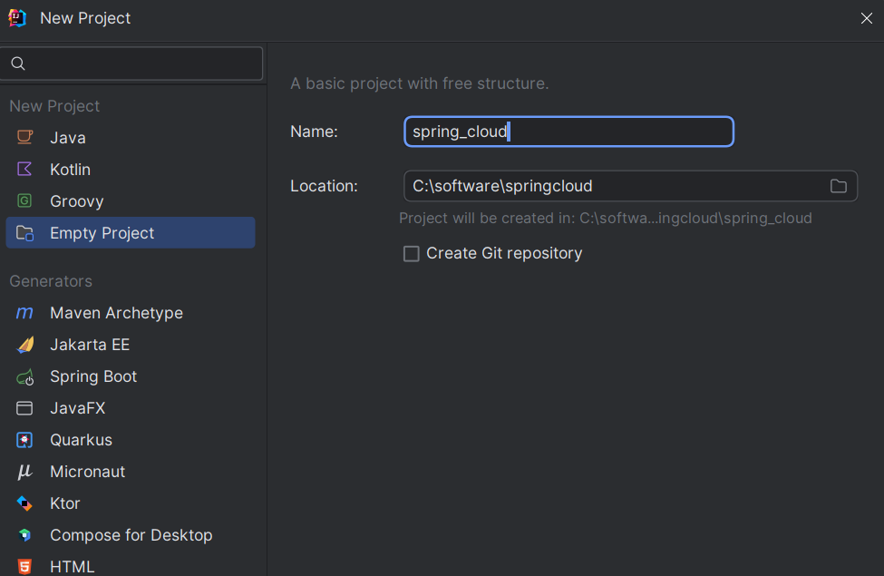
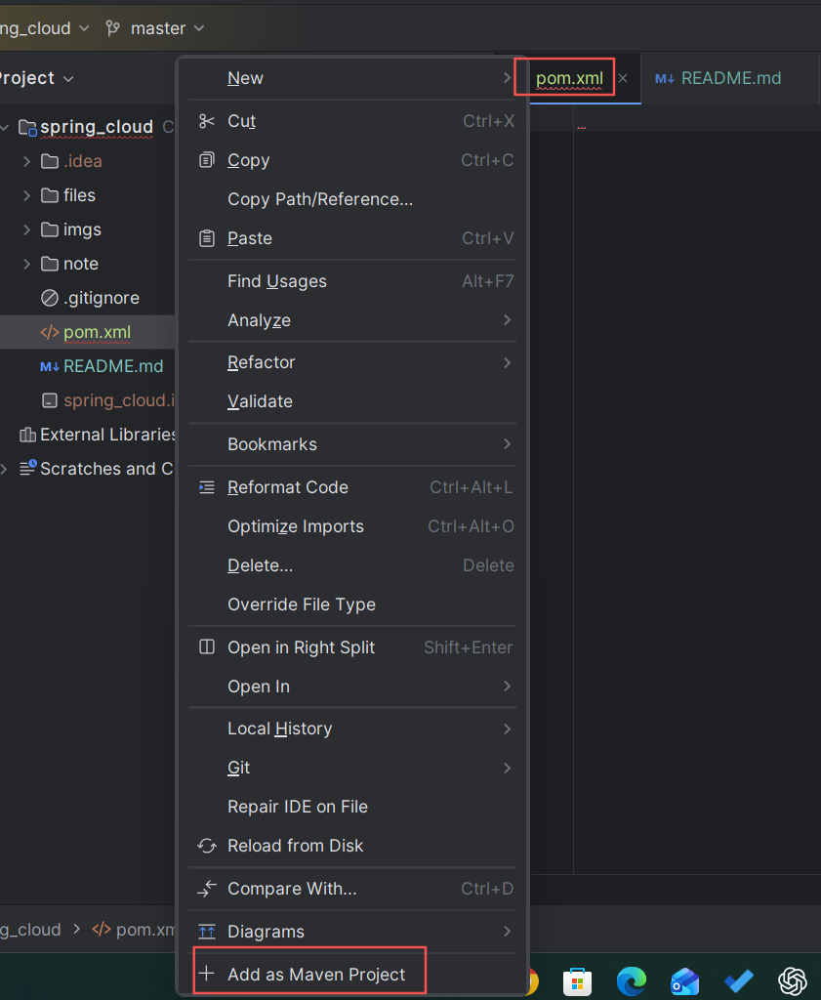

[toc]

# 1、`Nacos` 注册中心

`Nacos` 可以直接提供注册中心（`Eureka`）+配置中心（`Config`），所以它的好处显而易见，我们在前面成功安装和启动了`Nacos`以后就可以发现`Nacos`本身就是一个小平台，它要比之前的`Eureka`更加方便，不需要我们在自己做配置。

服务发现是微服务架构中的关键组件之一。在这样的架构中，手动为每个客户端配置服务列表可能是一项艰巨的任务，并且使得动态扩展极其困难。`Nacos Discovery` 帮助您自动将您的服务注册到 `Nacos` 服务器，`Nacos` 服务器会跟踪服务并动态刷新服务列表。此外，`Nacos Discovery` 将服务实例的一些元数据，如主机、端口、健康检查 `URL`、主页等注册到 `Nacos`。

官方文档: https://spring.io/projects/spring-cloud-alibaba#learn

# 2、创建父项目

1、创建一个空项目



2、在项目根目录下创建一个 `pom.xml` 文件，然后右键该文件，将项目转成 `maven` 项目



3、添加如下配置

```xml
<?xml version="1.0" encoding="UTF-8"?>
<project xmlns="http://maven.apache.org/POM/4.0.0" xmlns:xsi="http://www.w3.org/2001/XMLSchema-instance"
         xsi:schemaLocation="http://maven.apache.org/POM/4.0.0 https://maven.apache.org/xsd/maven-4.0.0.xsd">
    <modelVersion>4.0.0</modelVersion>

    <groupId>com.example.springcloud</groupId>
    <artifactId>spring_cloud</artifactId>
    <version>1.0-SNAPSHOT</version>
    <packaging>pom</packaging>

    <properties>
        <maven.compiler.source>8</maven.compiler.source>
        <maven.compiler.target>8</maven.compiler.target>
        <spring-cloud-alibaba-version>2021.1</spring-cloud-alibaba-version>
        <spring-cloud.version>2020.0.1</spring-cloud.version>
    </properties>

    <dependencyManagement>
        <dependencies>
            <dependency>
                <groupId>com.alibaba.cloud</groupId>
                <artifactId>spring-cloud-alibaba-dependencies</artifactId>
                <version>${spring-cloud-alibaba-version}</version>
                <type>pom</type>
                <scope>import</scope>
            </dependency>
            <dependency>
                <groupId>org.springframework.cloud</groupId>
                <artifactId>spring-cloud-dependencies</artifactId>
                <version>${spring-cloud.version}</version>
                <type>pom</type>
                <scope>import</scope>
            </dependency>
        </dependencies>
    </dependencyManagement>

</project>
```


