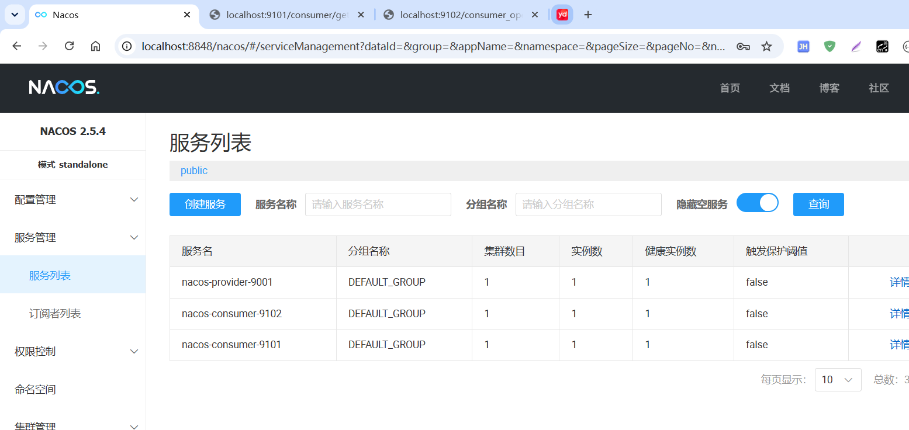

[toc]

# 1、`Nacos` 注册中心

`Nacos` 可以直接提供注册中心（`Eureka`）+配置中心（`Config`），所以它的好处显而易见，我们在前面成功安装和启动了`Nacos`以后就可以发现`Nacos`本身就是一个小平台，它要比之前的`Eureka`更加方便，不需要我们在自己做配置。

服务发现是微服务架构中的关键组件之一。在这样的架构中，手动为每个客户端配置服务列表可能是一项艰巨的任务，并且使得动态扩展极其困难。`Nacos Discovery` 帮助您自动将您的服务注册到 `Nacos` 服务器，`Nacos` 服务器会跟踪服务并动态刷新服务列表。此外，`Nacos Discovery` 将服务实例的一些元数据，如主机、端口、健康检查 `URL`、主页等注册到 `Nacos`。

官方文档: https://spring.io/projects/spring-cloud-alibaba#learn

# 2、创建父项目

1、创建一个空项目


2、在项目根目录下创建一个 `pom.xml` 文件，然后右键该文件，将项目转成 `maven` 项目


3、添加如下配置

```xml
<?xml version="1.0" encoding="UTF-8"?>
<project xmlns="http://maven.apache.org/POM/4.0.0" xmlns:xsi="http://www.w3.org/2001/XMLSchema-instance"
         xsi:schemaLocation="http://maven.apache.org/POM/4.0.0 https://maven.apache.org/xsd/maven-4.0.0.xsd">
    <modelVersion>4.0.0</modelVersion>

    <groupId>com.example.springcloud</groupId>
    <artifactId>spring_cloud</artifactId>
    <version>1.0-SNAPSHOT</version>
    <packaging>pom</packaging>

    <properties>
        <maven.compiler.source>8</maven.compiler.source>
        <maven.compiler.target>8</maven.compiler.target>
        <spring-cloud-alibaba-version>2021.1</spring-cloud-alibaba-version>
        <spring-cloud.version>2020.0.1</spring-cloud.version>
    </properties>

    <dependencyManagement>
        <dependencies>
            <dependency>
                <groupId>com.alibaba.cloud</groupId>
                <artifactId>spring-cloud-alibaba-dependencies</artifactId>
                <version>${spring-cloud-alibaba-version}</version>
                <type>pom</type>
                <scope>import</scope>
            </dependency>
            <dependency>
                <groupId>org.springframework.cloud</groupId>
                <artifactId>spring-cloud-dependencies</artifactId>
                <version>${spring-cloud.version}</version>
                <type>pom</type>
                <scope>import</scope>
            </dependency>
        </dependencies>
    </dependencyManagement>

</project>
```

# 3、`NacosProvider` 注册服务提供作者

## 3.1、创建 `NacosProvider` 项目

新建 `spring boot` 的 `module` 详见 [01_NacosProvicer_9001](../01_NacosProvider_9001)

`spring boot` 的版本详见 [pom.xml](../01_NacosProvider_9001/pom.xml)

新建 `src/main/resources/application.yml` 文件

```yml
server:
  port: 9001
spring:
  application:
    name: nacos-provider-9001
  cloud:
    nacos:
      discovery:
        server-addr: 127.0.0.1:8848
        # 前面已经开启鉴权
        username: nacos
        password: nacos

management:
  endpoints:
    web:
      exposure:
        include: "*"
```

在 `Application` 启动类上添加 `@EnableDiscoveryClient` 注解

```java
@SpringBootApplication
@EnableDiscoveryClient
public class ProviderApplication {

    public static void main(String[] args) {
        SpringApplication.run(ProviderApplication.class, args);
    }

}
```

## 3.2、添加 `NacosProvider` 服务接口

添加 `TestController` 类，添加如下服务接口

```java
@RestController
public class TestProviderController {

    @Value("${server.port}")
    private String port;

    @GetMapping("/provider/get_port")
    public String getServerPort() {
        return "Hello Nacos Discovery, server port: " + port;
    }

}
```

## 3.3、启动服务

启动 `NacosProvider` 服务后，可以在 `nacos` 的服务列表中看到当前服务已经注册


# 4、`NacosConsumer` 注册服务消费者

## 4.1、创建 `NacosConsumer` 消费者

创建 `spring boot` 的 `module` 详见 [02_NacosConsumer_9101](../02_NacosConsumer_9101/)

`spring boot` 的版本详见 [pom.xml](../02_NacosConsumer_9101/pom.xml)

新建 `src/main/resources/application.yml` 文件

```yml
server:
  port: 9101
spring:
  application:
    name: nacos-consumer-9101
  cloud:
    nacos:
      discovery:
        username: nacos
        password: nacos
        server-addr: localhost:8848
        
service-url:
  nacos-user-service: http://nacos-provider
```

同样需要在启动类上添加 `@EnableDiscoveryClient` 注解

```java
@SpringBootApplication
@EnableDiscoveryClient
public class ConsumerApplication {

    public static void main(String[] args) {
        SpringApplication.run(ConsumerApplication.class, args);
    }

}
```

启动服务，可以在 `nacos` 服务列表上看到当前服务


# 5、服务调用

上面我们创建了服务的提供者和服务的消费者。但是都只是完成了服务的 `nacos` 注册。并没有串联起来。在我们使用的 `SpringCloudAlibaba2021` 版本中移除了`Ribbon`，因为`Ribbon`已经停止更新维护了。使用`loadBalancer`作用新的负载均衡器。我们需要添加新的依赖。

```xml
<dependency>
    <groupId>org.springframework.cloud</groupId>
    <artifactId>spring-cloud-starter-loadbalancer</artifactId>
</dependency>
```

然后需要配置 `RestTemplate` 来实现远程调用

```java
@Configuration
public class RestTemplateConfig {

    @Bean
    @LoadBalanced
    public RestTemplate getRestTemplate() {
        return new RestTemplate();
    }

}
```

在 `consumer` 新增 `controller`

```java
@RestController
public class TestConsumerController {

    @Autowired
    private RestTemplate restTemplate;

    @Value("${service-url.nacos-user-service}")
    private String serverURL;

    @GetMapping(value = "/consumer/get_port")
    public String getDiscovery() {
        System.out.println("serverURL:" + serverURL);
        // url: 表示被调用的目标rest接口位置
        // url的第一部分是在 `nacos` 中注册的服务提供者名称，如果多个服务提供注册名称相同名称，Ribbon 会自动寻找其中一个服务提供者，并调用接口方法。这个就是负载均衡功能。
        // url后半部分就是控制器的请求路径
        // 第二个参数是返回值类型
        // 第三个参数是可变参数，是传递给url的动态参数
        return restTemplate.getForObject(serverURL + "/provider/get_port", String.class);
    }

}
```

调用结果如下:


# 6、`Openfeign` 服务调用

`Openfeign` 是一个声明式的服务调用组件。本质上是封装的 `Ribbon` 实现的。


`Openfeign` 依赖

```xml

<dependency>
    <groupId>org.springframework.cloud</groupId>
    <artifactId>spring-cloud-starter-openfeign</artifactId>
</dependency>
```

创建对应的 `feign` 接口

```java
// 使用 @FeignClient 注解需要指明服务的名称
@FeignClient(name = "nacos-provider-9001")
public interface TestProviderService {

    @GetMapping("/provider/get_port")
    String getServerPort();

}
```

在启动类中添加 `@EnableFeignClients` 注解，并设置扫描的包目录

```java
@SpringBootApplication
@EnableDiscoveryClient
@EnableFeignClients(basePackages = "com.example.springcloud.consumer.openfeign.rpc")
public class ConsumerOpenFeignApplication {

    public static void main(String[] args) {
        SpringApplication.run(ConsumerOpenFeignApplication.class, args);
    }

}
```

创建 `controller`，远程调用 `provider` 的方法

```java
@RestController
public class TestConsumerOpenFeignController {

    @Autowired
    private TestProviderService testProviderService;

    @Value("${service-url.nacos-user-service}")
    private String serverURL;

    @GetMapping("/consumer_open_feign/get_port")
    public String getServerPort(){
        System.out.println("使用open feign访问provider, serverURL: " + serverURL);
        return testProviderService.getServerPort();
    }

}
```

启动服务，在注册中心查看服务



访问 `localhost:9102/consumer_open_feign/get_port` 结果如下:


# 7、注册中心对比

| 服务注册与发现框架 | CAP模型 | 控制台管理 | 社区活跃度      |
| ------------------ | ------- | ---------- | --------------- |
| Eureka             | AP      | 支持       | 低(2.x版本闭源) |
| Zookeeper          | CP      | 不支持     | 中              |
| Consul             | CP      | 支持       | 高              |
| Nacos              | AP/CP   | 支持       | 高              |

## 7.1、`CAP`模型

计算机专家 埃里克·布鲁尔（`Eric Brewer`）于 2000 年在 `ACM` 分布式计算机原理专题讨论会（简称：`PODC`）中提出的分布式系统设计要考虑的三个核心要素：

- 一致性(`Consistency`): 同一时刻的同一请求的实例返回的结果相同，所有的数据要求具有强一致性(`Strong Consistency`)
- 可用性(`Availability`): 所有实例的读写请求在一定时间内可以得到正确的响应
- 分区容错性(`Partition tolerance`): 在网络异常（光缆断裂、设备故障、宕机）的情况下，系统仍能提供正常的服务

以上三个特点就是 `CAP` 原则（又称`CAP`定理），但是三个特性不可能同时满足，所以分布式系统设计要考虑的是在满足`P`（分区容错性）的前提下选择`C`（一致性）还是`A`（可用性），即:`CP`或`AP`;

## 7.2、`CP`原则

>  一致性 + 分区容错性原则

`CP` 原则属于强一致性原则，要求所有节点可以查询的数据随时都要保持一直（同步中的数据不可查询），即:若干个节点形成一个逻辑的共享区域，某一个节点更新的数据都会立即同步到其他数据节点之中，当数据同步完成后才能返回成功的结果，但是在实际的运行过程中网络故障在所难免，如果此时若干个服务节点之间无法通讯时就会出现错误，从而牺牲了以可用性原则（`A`），例如关系型数据库中的事务。

## 7.3、AP原则

>  可用性原则 + 分区容错性原则

`AP` 原则属于弱一致性原则，在集群中只要有存活的节点那么所发送来的所有请求都可以得到正确的响应，在进行数据同步处理操作中即便某些节点没有成功的实现数据同步也返回成功，这样就牺牲一致性原则（`C` 原则）。

使用场景：对于数据的同步一定会发出指令，但是最终的节点是否真的实现了同步，并不保证，可是却可以及时的得到数据更新成功的响应，可以应用在网络环境不是很好的场景中。

## 7.4、`Nacos` 的 `AP/CP`

`Nacos` 无缝支持一些主流的开源生态，同时再阿里进行`Nacos`设计的时候重复的考虑到了市场化的运作（市面上大多都是以单一的实现形式为主，例如：`Zookeeper`使用的是 `CP`、而 `Eureka`采用的是`AP`），在`Nacos`中提供了两种模式的动态切换。

1. 一般来说，如果不需要储存服务界别的信息且服务实例通过`nacos-client`注册，并能够保持心跳上报，那么就可以选择`AP`模式。如`Spring Cloud` 和 `Dubbo`，都适用于`AP`模式，`AP`模式为了服务的可用性减弱了一致性，因此AP模式下只支持注册`临时实例`。
2. 如果需要在服务级别编辑或者储存配置信息，那么`CP`是必须的，`K8S`服务和`DNS`服务则是用于`CP`模式。`CP`模式下则支持注册`持久化实例`，此时则是以`Raft`协议为集群运行模式，该模式下注册实例之前必须先注册服务，如果服务不存在，则会返回错误。
3. 切换命令（默认是`AP`）：

```shell
curl -X PUT '$NACOS_SERVER:8848/nacos/v1/ns/operator/switches?entry=serverMode&value=CP'
```

注意：临时和持久化的区别主要在`健康检查`失败后的表现，持久化实例健康检查失败后会被标记成不健康，而临时实例会直接从列表中被删除。


