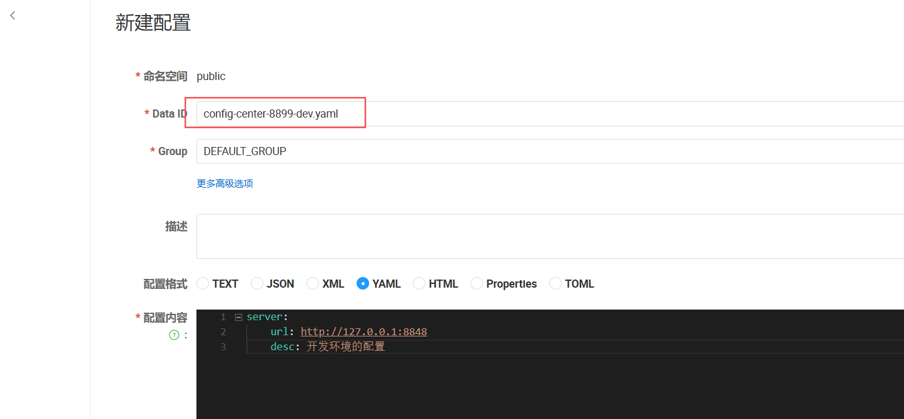
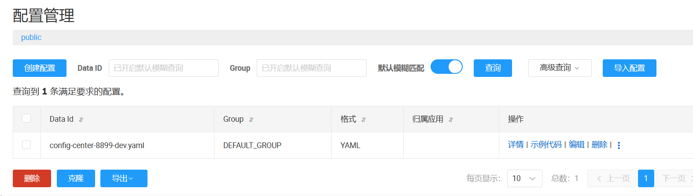
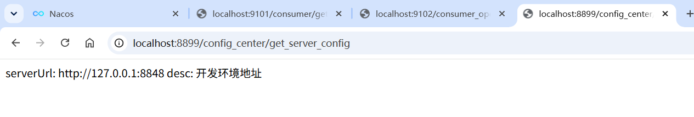
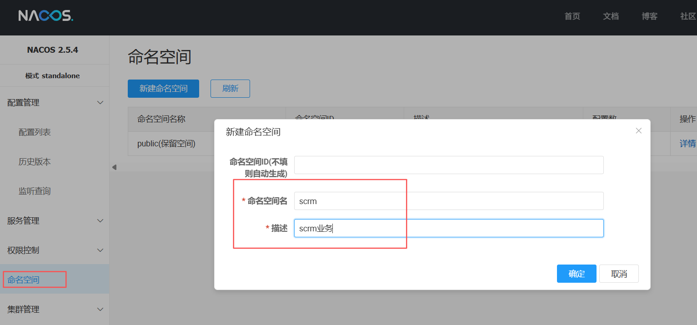
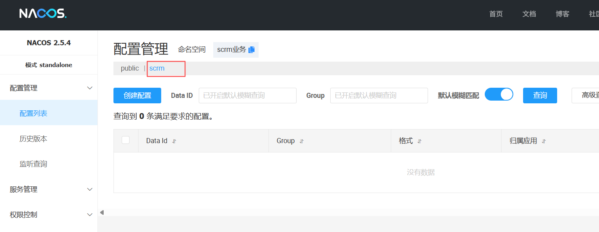

[toc]

# 1、什么是 `Nacos` 配置中心

`Nacos` 配置中心用于集中保存应用运行时需要的配置，并让应用从 `Nacos` 获取这些配置。配置可以是数据库连接地址、业务开关、超时时间、线程池参数等。

可以把 `Nacos` 的两个功能简单区分为：

- **服务发现**：记录服务实例在哪里，让调用方找到服务。
- **配置管理**：记录应用运行时使用什么参数，让应用读取配置。

`Nacos` 配置由三个关键标识共同定位：

| 名称                | 含义                                 | 示例                                                    |
|-------------------|------------------------------------|-------------------------------------------------------|
| `Namespace`（命名空间） | 配置和服务的隔离边界，可按业务、环境或租户划分            | `srcm`、`oa`、`dev`、`prod`（客户端配置时使用控制台显示的 Namespace ID） |
| `Group`（分组）       | Namespace 内的逻辑分组                   | `DEFAULT_GROUP`、`PAY_GROUP`                           |
| `Data ID`         | 一份配置的名称，通常由应用名、环境/Profile 和文件扩展名组成 | `config-center-8899-dev.yaml`                         |

应用要用正确的 `Namespace`、`Group` 和 `Data ID` 才能取到目标配置。只要其中一项不匹配，就可能出现配置“明明发布了，应用却读不到”的情况。

# 2、配置中心能做什么

1. **集中管理配置**：不用登录每台服务机器逐个修改配置文件。
2. **按需隔离配置和服务**：`Namespace` 可以按业务（如 `srcm`、`oa`）、环境（如 `dev`、`prod`）或租户划分；开发、测试和生产也可以使用不同
   `Data ID`。
3. **多应用共享配置**：把共同参数放在单独的配置项中供多个应用读取。
4. **动态更新配置**：对支持刷新的配置，发布后应用可以在运行中获得新值，减少重启。
5. **集中查看和回滚**：通过 `Nacos` 控制台查看配置内容和变更历史；是否支持回滚及操作流程以当前 `Nacos` 版本和权限配置为准。

# 3、当前项目版本怎么接入

当前项目的版本是 `Spring Boot 2.4.2`、`Spring Cloud 2020.0.1`、`Spring Cloud Alibaba 2021.1`，`Java 8`。本节按这套旧版组合说明，使用
**`bootstrap` 加载方式**。不要把新版 `Spring Cloud Alibaba` 文档里的 `spring.config.import` 示例不加区分地复制过来；不同版本的配置加载机制有差异。

`Spring Cloud 2020.0.x` 默认不再启用旧 `bootstrap` 加载机制。使用下面的 `bootstrap.yml`
前，需要在应用模块中显式添加 `bootstrap starter`。

## 3.1、添加依赖

在 [`pom`](../04_NacosConfigCenter_8899/pom.xml) 文件中添加 `nacos` 配置中心的依赖，以及 `bootstrap` 的依赖

```xml
<!-- 添加 nacos 配置中心依赖 -->
<dependency>
    <groupId>com.alibaba.cloud</groupId>
    <artifactId>spring-cloud-starter-alibaba-nacos-config</artifactId>
</dependency>

<!-- Spring Cloud 2020 默认关闭 bootstrap，需要显式启用旧式 bootstrap 加载 -->
<dependency>
    <groupId>org.springframework.cloud</groupId>
    <artifactId>spring-cloud-starter-bootstrap</artifactId>
</dependency>
```

## 3.2、创建 bootstrap.yml

在模块的 `src/main/resources/` 下创建 `bootstrap.yml`。以 Provider 为例：

```yaml
spring:
  application:
    name: config-center-8899
  profiles:
    active: dev
  cloud:
    nacos:
      discovery:
        password: nacos
        username: nacos
        server-addr: localhost:8848
      # config 配置需要先添加配置中心的 pom 依赖
      config:
        server-addr: localhost:8848
        password: nacos
        username: nacos
        # 设置配置文件的格式
        file-extension: yaml

```

说明：

- `spring.application.name` 和激活的 `Profile` 用于拼出环境配置的 `Data ID`。这里应用名为 `config-center-8899`
  ，环境 `Profile` 为 `dev`。
- `file-extension: yaml` 表示默认配置使用 `YAML` 格式，`Data ID` 后缀是 `.yaml`。
- `namespace` 用于隔离配置和服务，可按业务（如 `srcm`、`oa`
  ）、环境或租户规划。它不限定只能用于环境隔离。客户端配置要填写 `Nacos`
  控制台中的 **Namespace ID**，不要仅凭显示名称猜 ID。使用默认公共命名空间时通常省略此项；自定义命名空间则填写控制台中的实际
  ID。
- `username` 和 `password` 是 `Nacos` 开启鉴权时使用的凭据；若服务端没开鉴权，可按部署情况省略。不要将生产凭据提交到 `Git`。
- 服务发现使用的 `spring.cloud.nacos.discovery.*` 与配置中心的 `spring.cloud.nacos.config.*` 是两组设置。实际项目可共用同一个
  Nacos 地址和账号，但两边需要分别配置。

在 `application.yml` 中配置端口和环境

```yaml
server:
  port: 8899

spring:
  profiles:
    # 配置当前为开发环境
    active: dev
```

## 3.3、在 `Nacos` 控制台发布配置

打开 Nacos 控制台的“配置管理 / 配置列表”，新增一条配置：

| 字段        | 示例值                                     |
|-----------|-----------------------------------------|
| Namespace | 与应用配置一致；按隔离规划选择业务/环境命名空间，默认公共命名空间可省略 ID |
| Group     | `DEFAULT_GROUP`                         |
| Data ID   | `config-center-8899-dev.yaml`           |
| 配置格式      | YAML                                    |



```yaml
server:
  url: http://127.0.0.1:8848
  desc: 开发环境的配置
```

点击发布后，应用启动时会从 Nacos 读取这份配置。按环境区分的 `Data ID` 规则是：

```text
${spring.application.name}-${spring.profiles.active}.${spring.cloud.nacos.config.file-extension}
```

例如应用名为 `config-center-8899`、激活的 Profile 为 `dev`、扩展名为 `yaml` 时，Data ID 是 `config-center-8899-dev.yaml`
；生产环境为 `prod` 时则是 `config-center-8899-prod.yaml`。如果需要同时维护不区分环境的通用配置，也可以使用不带 Profile
的 `config-center-8899.yaml`。建议通过启动参数或环境变量选择 Profile，不要把生产 Profile 固定写进所有环境共用的配置文件。



## 3.4、在代码中读取配置

使用 `@Value` 读取单个配置项：

```java

@Data
@RefreshScope   // 配置 nacos 动态刷新功能
@Configuration
public class NacosConfig {

    @Value("${server.url}")
    private String url;

    @Value("${server.desc}")
    private String desc;

}
```




`@RefreshScope` 用于让这个 `Spring Bean` 在刷新时重新创建，从而重新注入更新后的值。修改 `Nacos`
配置并发布后，可再次访问接口观察值是否改变。实际使用时，可用 `@ConfigurationProperties`
将一组相关配置绑定到类型安全的配置类中；动态刷新是否符合预期，要在所用版本上验证。

配置也可以由 Spring `Environment` 读取：

```java
String greeting = environment.getProperty("demo.greeting");
```

配置中心负责提供值，不会自动让业务代码使用该值；代码仍需通过 `@Value`、`@ConfigurationProperties` 或 `Environment` 读取。

# 4、命名空间

新增一个命名空间 `scrm`



然后在配置列表中就可以看到新增的命名空间



在`bootstrap.yaml`中设置命名空间

```yaml
spring:
  application:
    name: config-center-8899
  cloud:
    nacos:
      discovery:
        password: nacos
        username: nacos
        server-addr: localhost:8848
      # config 配置需要先添加配置中心的 pom 依赖
      config:
        server-addr: localhost:8848
        password: nacos
        username: nacos
        # 设置配置文件的格式
        file-extension: yaml
        # 设置命名空间，注意，这里要使用命名空间Id
        namespace: b27f3952-7a9c-4b5d-a6dc-b56badaf7240
```

访问 `http://localhost:8899/config_center/get_server_config` 可以看到读取到的配置已经是 `scrm` 命名空间下的配置

